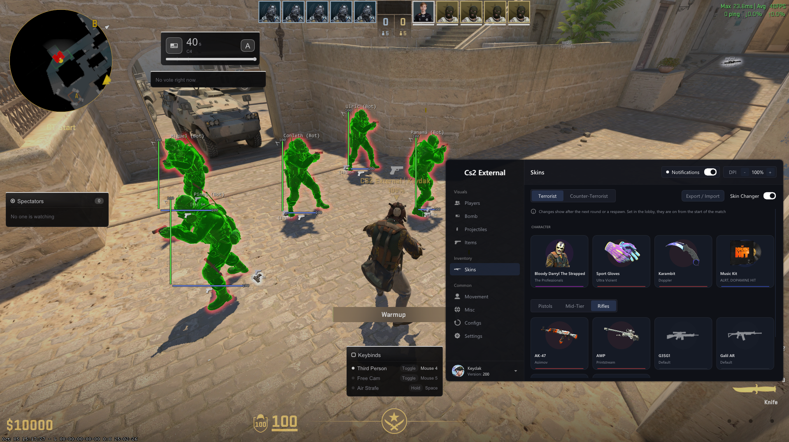
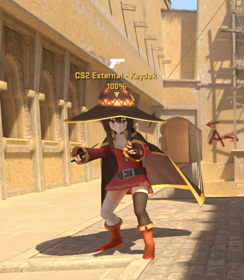
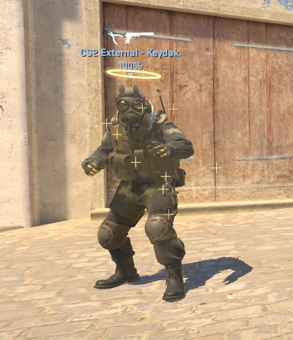
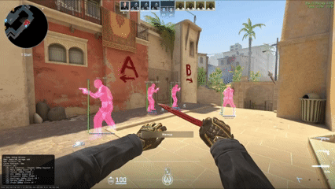

# CS2 External ESP

External ESP for Counter-Strike 2, a fork of [IMXNOOBX/cs2-external-esp](https://github.com/IMXNOOBX/cs2-external-esp). This fork adds a reworked menu, more ESP & overlays, hit effects, a skin changer and more, and reads its offsets from the game itself so it keeps working through silent CS2 updates.

## Showcase

<!-- Replace .github/showcase.png with your own picture. To link a video, wrap it: [](https://youtu.be/...) -->





## ✨ Added Features

> This fork builds on top of the original project. Everything below is new or reworked.

**Menu**
* **New interface**: a dark, minimal menu in an AMOLED theme (deep black panels) with one accent color (white by default), a see through background with an opacity slider, animated tabs & controls. Five categories in the sidebar, their pages as pills at the top, panels with soft shadows & the Inter font. Every page fits without scrolling.
* **Quick settings**: the corner of the sidebar opens the credits, a few accent colors & the background opacity.
* **Startup toast**: shows the menu keys for a few seconds when the program starts.
* **Settings behind three dots**: what else a feature has (sizes, styles, sounds, its key & activation) opens in a small window from the dots before its toggle, so the panels stay short.
* **Long lists**: dropdowns show a few rows at a time, scroll, and have a search box when the list is long.
* **Side panels**: previews (ESP, bomb, grenades, items), the picked player of the profile page, the picked model of the model browser & what is picked in the skin changer (the skin with its wear & seed, the gloves, the knife under the mouse, the agent with the custom model tools, the music kit) show in a window next to the menu, so the options fit without scrolling.
* **Skin changer pages**: large cards, four a line, the back button & the search stay on top while the cards scroll.
* **Configs tab**: export / import configs & skin loadouts as separate files in `export/`, rename, delete & set one as **Default** (loaded on start).

**Read only (ESP & overlays)**
* **Player ESP**: box, skeleton, head tracker & flags placed by dragging them around a preview of the player. Its agents are pictures from the game, downloaded from the [assets repository](https://github.com/Keydak/cs2-external-assets) by the loader; when one is not there they are taken from the game itself in the main menu with `-insecure` (a loading card for a few seconds, once). Kept in `cache/agents`.
* **Grenade ESP**: smoke & molotov areas that follow the map collision (blocked by walls, doors & props), trails, timers, landing spots & a prediction for the grenade in hand. The prediction moves the grenade as the small box it is (it catches edges, rails & small bounces a line through its middle misses), leaves out the small props grenades fly through (hanging signs) and only traces the corners of the box near something, so it stays light. The trail of a thrown decoy goes away once it lies still.
* **Item ESP**: dropped weapons & other items in the world.
* **Visibility check**: players behind walls or inside smokes are drawn differently.
* **Hitmarker**: a mark at the crosshair and on the player you hit, with the damage, in its own color for a kill. Kills come from your own kill counter, so someone killed by another player near your hit is not counted.
* **Hit & kill sounds**: your own sounds with a volume each, `.vsnd_c`, `.wav` or `.mp3` from the `sound` folder, or downloaded from the [assets repository](https://github.com/Keydak/cs2-external-assets) with one click. One sound per hit, so the pellets of a shotgun stack up. A sound is heard when it is picked or its volume changed. Without `-insecure` Windows plays them, nothing is written into the game.
* **Profile page**: the players of the match in a list, the picked one in a card next to the menu with their model, rank / Premier rating, K/D/A & Steam details, and buttons to open their Steam profile, copy their ID or take their name.
* **Vote list**: the vote going on (kick, surrender, timeout…) with who called it on whom & its yes / no.
* **Overlays**: spectator list, keybind list, bomb site & timer, radar & velocity graph, all draggable and animated.
* **Game crosshair**: the crosshair overlay follows your own CS2 crosshair settings (style, color, size, dot).
* **Auto accept**: accepts when a match is found. Without `-insecure` it only looks at the game window & clicks the button.
* **Performance**: the overlay is held to the refresh rate of your monitor (no V-Sync delay), ESP positions are read again for every frame so fast players do not shake, frame time breakdown in the watermark.

**Memory writing (only with `-insecure`, see the warning below)**
* **Skin changer**: weapon skins, knives, gloves, agents & music kits (round music & MVP anthem), with player model previews.
* **Custom player models**: models made for CS2 players (e.g. from [GameBanana](https://gamebanana.com/mods/cats/22484)) picked like an agent, only you see them. Each model is checked before it can be picked (CS2 skeleton, animations of the current game, every file it needs), so a model that would crash or T-pose is not loaded. A model that sits in the wrong folder is moved where it was made for with one click. In first person its own hands are shown and the gloves of the game hidden; a model without hands of its own keeps the arms of your agent with your glove skin. A new pick is put on at the next respawn.
* **Model browser**: the player models of GameBanana inside the menu, with big pictures, a search & a filter (all, downloaded, not downloaded). One click downloads a model, unpacks it (zip, rar & 7z) and puts it in the game folder, one more removes it. Models are checked before they are listed: ones made for the old animations or not rigged for CS2 are left out, and ones without first person hands of their own get a badge. The list & the checks are kept, so the browser opens at once after the first run.
* **View**: custom FOV, viewmodel override (FOV 40 – 120, offsets ±20), third person, free cam & casual spectating after death (in first person through the camera of the game itself, as smooth as its own spectating), and how much the camera kicks when you shoot or get hit (view punch, only what you see).
* **Material chams**: players drawn by the game again with materials made for them, one where they can be seen and one behind walls & smokes, each with its own color, for enemies & teammates, and also for the planted bomb, items on the ground, your own agent & hands, and the weapon in your hands. One material per group, from Flat (one color, no light), Glow (lit edges), Hologram (see through, its color added over what is behind; in first person a glowing edge look) & Metallic.
* **Kill effects**: an enemy you kill disappears into an effect. Particles of the game (Ashes, Explosion, Blood, Electric on the body), finishers drawn over the game where it died (Zeus lightning from the sky with a white flash, Singularity black hole, Shatter, Glitch, Ascend beam of light, Frost, Slash, Pixels, Meteor, Tornado, TV Off, Supernova; fainter for wallbangs) or No gravity, the bodies floating away.
* **Self effects**: an effect on your own player, in third person only if you want. Particles of the game (Electric, Ashes) or auras drawn around you (Storm, Void, Halo, Frost, Rings, Fireflies, Sakura, Blades, Matrix, Shield, Trail).
* **Game radar**: enemies shown on the radar of the game.
* **Visuals**: no flash (with a strength slider), no smoke. Chams (players colored by the game itself, off while a player is spawn protected) & the outline glow of the game for players, the bomb, dropped items, dropped grenades & thrown grenades, in their ESP tabs.
* **Movement**: bunny hop, auto strafe, jump bug, quick stop & null binds, each with its own key & activation (toggle, hold, always).
* **Clan tag & name**: custom tag with 12 animations, several texts taking turns, shown in the clan slot, before / after the name or as the whole name, and a custom name. The name (with the tag in it) is also sent to the server, so the other players see it, without typing anything in the console.
* **Voter names**: who voted yes or no in a vote, with their profile picture (experimental).
* **Hit & kill sounds in the game**: the sounds are played by the sound system of CS2 itself, so they mix with the game & follow its volume. Our sound folder is added to the files of the game and its `playvol` is called directly (nothing is typed into the console). While the game is not the window in front (menu open, alt tab), Windows plays them.

**Keeping up with CS2 updates**
* **Offsets from the game itself**: every field the program uses is read from the game files at startup, [cs2-dumper](https://github.com/a2x/cs2-dumper) is only a fallback.
* **Stops instead of breaking**: when something can't be found after an update, the program puts everything back and stops. A debug build says what was not found, a release build says it needs an update.
* **Update check**: tells when a newer version of this fork is out.

> [!WARNING]
> **The features under "Memory writing" are dangerous.** They write into the memory of the game (and patch some of its code), which is far easier for an anti-cheat to notice than only reading it.
>
> * They are **only enabled when CS2 is launched with `-insecure`**, which disables VAC so you cannot join secured servers. Never try to use them in matchmaking or on VAC / third party anti-cheat servers, **you will get banned**.
> * Use them **offline** (practice / bots) only. You are the only one responsible for what happens to your account.
> * Changes are put back when the feature is turned off or the program is closed. Close the program **before** the game, so CS2 does not save the overridden values (e.g. `viewmodel_*`) into its config.

## 🌳 Simple Use

- **Build it yourself** by following the [developer instructions](#-developer-instructions), or download it from [**Releases**](https://github.com/Keydak/cs2-external-esp/releases) when there is one.
- Open the game & `cs2-external-esp.exe`. Press **INSERT** or **RIGHT SHIFT** to open the menu.
- **Star** the repository **if** you **like the project**! ⭐

> If the app crashes on startup, you may be missing the latest [Windows Visual C++ redistributables](https://learn.microsoft.com/en-us/cpp/windows/latest-supported-vc-redist?view=msvc-170#latest-supported-redistributable-version). Install the appropriate package for your system:
>
> - [64-bit Windows](https://aka.ms/vc14/vc_redist.x64.exe) *for most modern systems*
> - [32-bit](https://aka.ms/vc14/vc_redist.x86.exe) *for older devices*

> [!IMPORTANT]
> Make sure your game is in full screen windowed❗

## 💡 Important

> This project is provided *'as is'* for learning purposes with no warranties or responsibility from the developers/contributors. Use it at your own risk; you are the only one accountable for your actions

* **Detection Status:** This project is intended solely for single-player use.
* **Anti-Virus Alerts:** This software may resemble malware in behavior because it accesses other processes memory, so it is commonly flagged by anti‑virus programs. I strongly encourage you to read the source code and build it yourself by following the [developer instructions](#-developer-instructions).

## 📘 Developer Instructions

1. Clone the repository. Copy the command below so the dependencies are cloned too

```sh
git clone --recursive https://github.com/Keydak/cs2-external-esp
```

* If you cloned the repository before submodules were added, run `git submodule update --init --recursive`

2. Build the app using **Visual Studio 2022** (or later)
	- Build: **`x64 - Release`**

3. Locate your binary file in the folder `<arch>/<configuration>`, e.g., `x64/Release`.

* After a CS2 update, `update-project/check.bat` tells what changed in the game & what has to be updated.

## 🕹️ Original Project

This fork is based on the third version of [IMXNOOBX/cs2-external-esp](https://github.com/IMXNOOBX/cs2-external-esp). Its earlier versions:

* [Discord Overlay (2023)](https://github.com/IMXNOOBX/cs2-external-esp/tree/discord-overlay), the first and **simplest** version, great to start learning.
* [Gdi Overlay (2023-2025)](https://github.com/IMXNOOBX/cs2-external-esp/tree/gdi-overlay), with automatic offset updating & configurations.

## 💫 Credits

* [**IMXNOOBX**](https://github.com/IMXNOOBX) for the original [cs2-external-esp](https://github.com/IMXNOOBX/cs2-external-esp), which this fork is built on.
* [**Keydak**](https://github.com/Keydak) for this fork and the features added to it.
* All [contributors](https://github.com/IMXNOOBX/cs2-external-esp/graphs/contributors) of the original project!
* [**Inter**](https://github.com/rsms/inter) by The Inter Project Authors, the font of the menu ([SIL Open Font License 1.1](src/assets/fonts/Inter-LICENSE.txt)).
* [**a2x**](https://github.com/a2x) for his [offset dumper](https://github.com/a2x/cs2-dumper) and constant updates to it!

## 🔖 License & Copyright

This project is licensed under [**CC BY-NC 4.0**](https://creativecommons.org/licenses/by-nc/4.0/), like the original.

```diff
+ You are free to:
	• Share: Copy and redistribute the material in any medium or format.
	• Adapt: Remix, transform, and build upon the material.
+ Under the following terms:
	• Attribution: You must give appropriate credit, provide a link to the original source repository, and indicate if changes were made.
	• Non-Commercial: You may not use the material for commercial purposes.
- You are not allowed to:
	• Sell: This license forbids selling original or modified material for commercial purposes.
	• Sublicense: This license forbids sublicensing original or modified material.
```

### ©️ Copyright
The original project is ©️ by [IMXNOOBX](https://github.com/IMXNOOBX) and its contributors. The changes of this fork are ©️ by [Keydak](https://github.com/Keydak), under the same license. See the [LICENSE](LICENSE) file for details.
